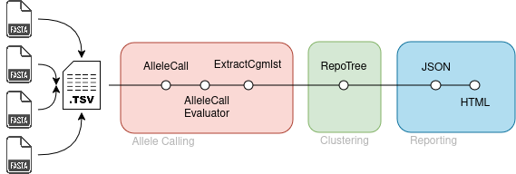

# BELLA Pipeline

This pipeline takes assembled bacterial genomes as input and performs a clustering analysis to support epidemiological inqueries into outbreak scenarios. It uses [Chewbbaca](https://chewbbaca.readthedocs.io/en/latest/) to perform cgMLST calling and then reconstructs the relationship of your samples with [ReporTree](https://github.com/insapathogenomics/ReporTree). ReporTree performs clustering of samples using a range of (pre-configured) distances, so makes it easy to adopt a pre-configured distance or inspect a range of distances. ReporTree allows you to feed your own nomenclature and metadata into the analysis. 

BELLA is primarily meant to be used with foodborne pathogens, such as Campylobacter, E. coli, Listeria monocytogenes and Salmonella enteria (i.e. it comes with allele schemas for these four species). Other species are supported of course, if you provide a compatible schema database (Chewbbaca v3.3x).

<b>Please note:</b> BELLA works with 'locked' schemas, meaning unlike the default <i>modus operandus</i> in Chewbbaca, new samples are not automatically added to the schema. Instead, analyses are always performed against the schema you originally installed. This is meant to prevent accidental conflicts arising from simultaneous access to the schema from two users or pipeline runs as well as accidentally contaminating the schema with bad samples. But more importantly, it ensures that analyses are reproducible across sites. If you find this to be limiting, please open an issue and we will look into ways to support 'open' schemas. 

## Documentation 

1. [What happens in this pipeline?](docs/pipeline.md)
2. [Installation and configuration](docs/installation.md)
3. [Running the pipeline](docs/usage.md)
4. [Output](docs/output.md)
5. [Software](docs/software.md)
5. [Troubleshooting](docs/troubleshooting.md)
6. [Developer guide](docs/developer.md)
