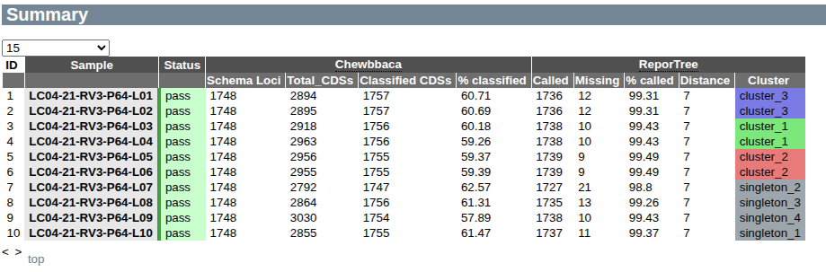
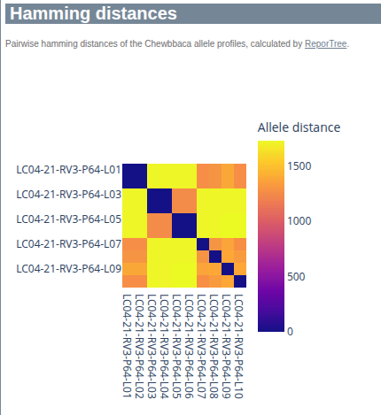
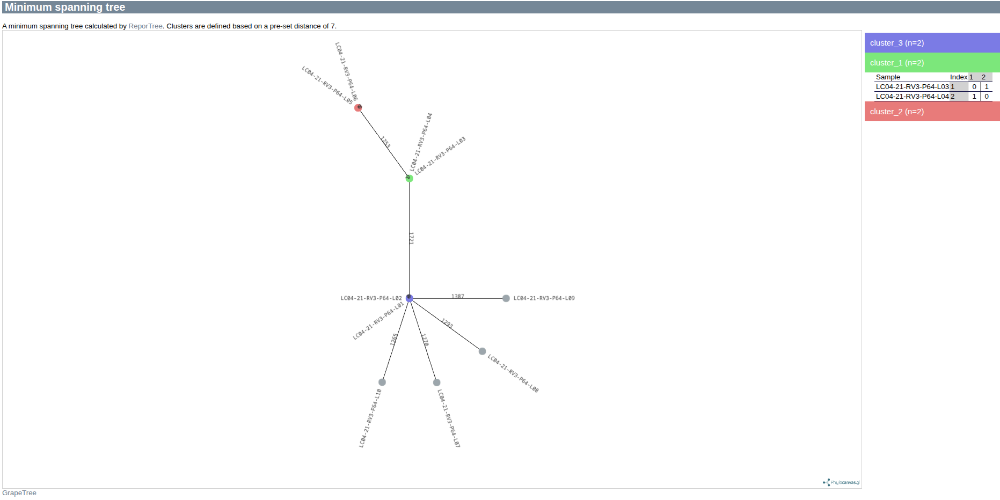

# Outputs 

## Chewbbaca allele calling

Relevant files include:

`sample/sample_id/chewbbaca/sample_id_resuls_alleles.tsv` - The per-sample allele profile
`sample/sample_id/chewbbaca/sample_id_resuls_alleles_hashed.tsv` -  The hashed version of the per-sample allele profile

The format in both cases is a TSV file, described [here](https://chewbbaca.readthedocs.io/en/latest/user/modules/AlleleCall.html)

Hashed profiles encode information about the underlying schema and are useful for comparisons across sites. 

## Chewbbaca QC

Chewbbaca will perform a per-run QC of the allele calls. Relevant files include:

`chewbbaca/evaluate_RUN_NAME/allelecall_report.html` - a graphical summary of relevant metrics described [here](https://chewbbaca.readthedocs.io/en/latest/user/modules/AlleleCallEvaluator.html)

## Clustering results

Clustering is performed with ReporTree and results are stored under `reportree`. The various files are documented [here](https://github.com/insapathogenomics/ReporTree/wiki/2.-Input-Output)

## HTML summary

Bella generates an interactive report in HTML file, summarizing the relevant per-sample metrics as well as resulting clustering using the pre-configured or user-specified clustering distance. 

### Summary

### Hamming distances

### Minimum spanning tree

## Pipeline run metrics

Relevant pipeline metrics and logs can be found under pipeline_info

- pipeline_dag.svg - the workflow graph (only available if GraphViz is installed)
- pipeline_report.html - the (graphical) summary of all completed tasks and their resource usage
- pipeline_report.txt - a short summary of this analysis run in text format
- pipeline_timeline.html - chronological report of compute tasks and their duration
- pipeline_trace.txt - Detailed trace log of all processes and their various metrics

