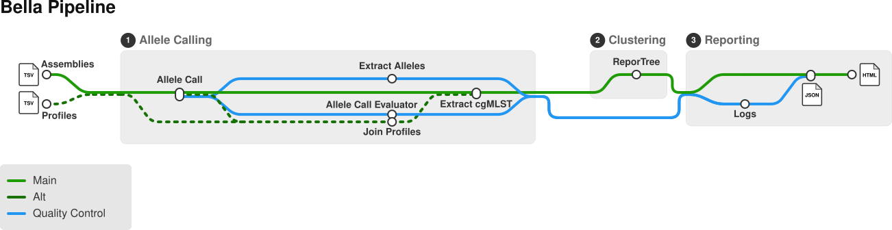

# Pipeline structure

BELLA can be divided into three stages:

1. Allele Calling

Assemblies are profiled using Chewbbaca against a reference schema, subsequently joined with (optional) pre-computed profiles from a previous run, and the entire set is then reduced down to a distance matrix with ambigious/missing positions masked. 

2. Clustering

The cleaned distance matrix is used to compute clusters and relevant metrics using ReporTree. 

3. Results and relevant metrics are summarized in JSON format, and compined into a graphical report in HTML format. 